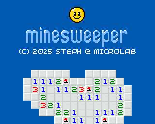

# Minesweeper

The aim of the game is to locate the mines that are scattered and buried in a rectangular grid. Each grid square can be empty or hide a mine. When you click on a square, its contents are revealed. If the square is empty, you remain unharmed, and the number of mines in neighboring squares is revealed. If, by chance, all the neighboring squares are empty, they are automatically dug out in turn, and so on, until the empty zone is completely delimited by numbers indicating the mines nearby. You must uncover all the empty squares without detonating a single mine. If you click on a square containing a mine, you explode, and the game ends.

You can suspect the presence of a mine on a square and flag it up. You progress through the game by placing your flags wisely. You have as many flags as there are hidden mines. No more. You win the game when you have marked all the mines with a flag and uncovered all the empty squares.

The mine-clearing operation must be completed within a limited time. You only have 999 seconds to locate all the mines on the grid. So don't delay!

3 levels of difficulty are available:

1. Beginner (30 mines)
2. Intermediate (50 mines)
3. Expert (70 mines)

Use button **[A]** to explore a square. Use button **[B]** to place or remove a flag. You can also press the **[MENU]** button to check the number of mines still to be discovered and the time already elapsed.

Good luck!

_This well-known game was supplied by default until version 7 of the Microsoft Windows operating system._